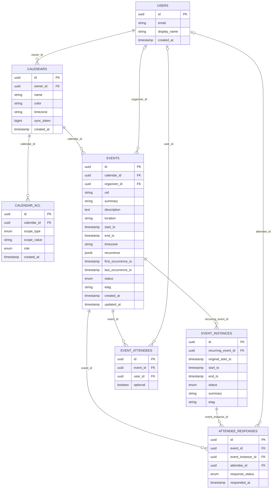
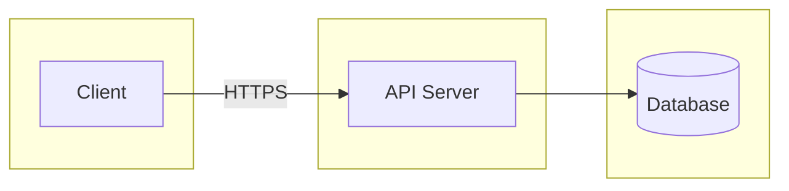
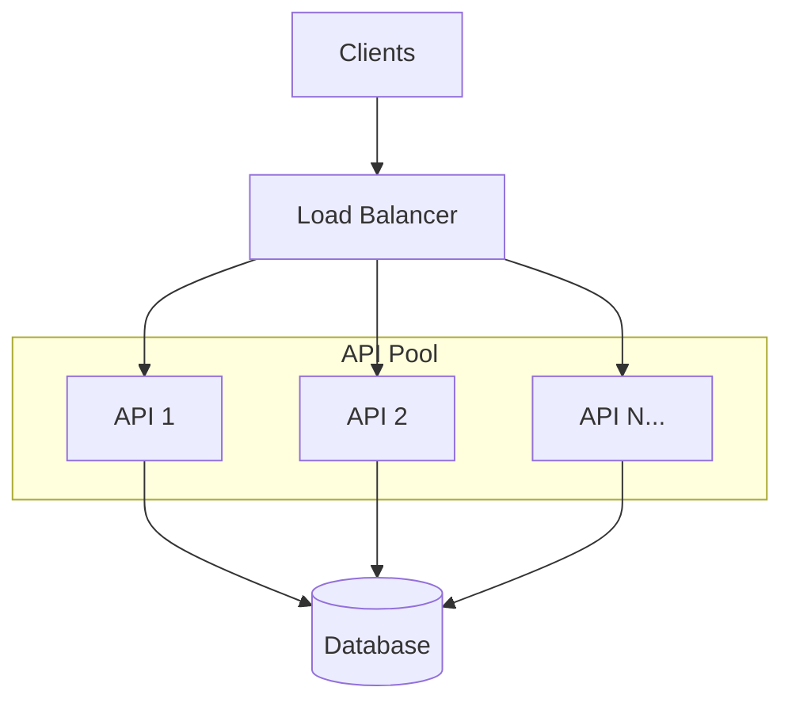
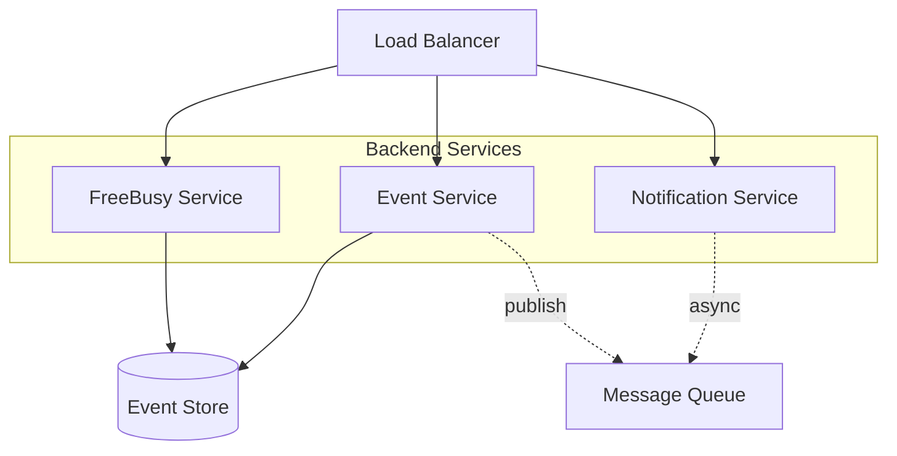
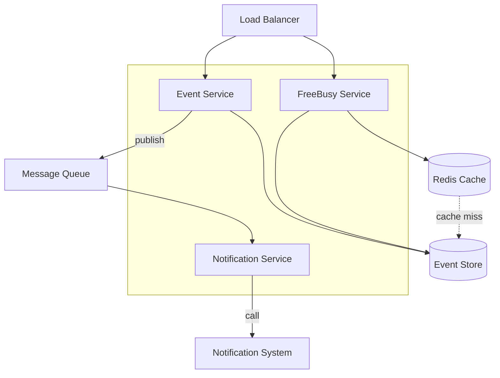
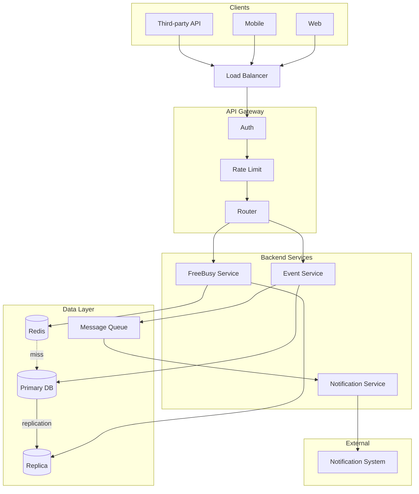
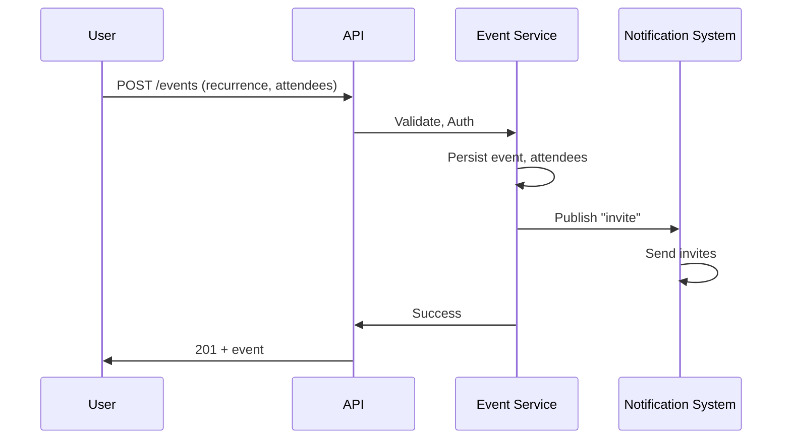
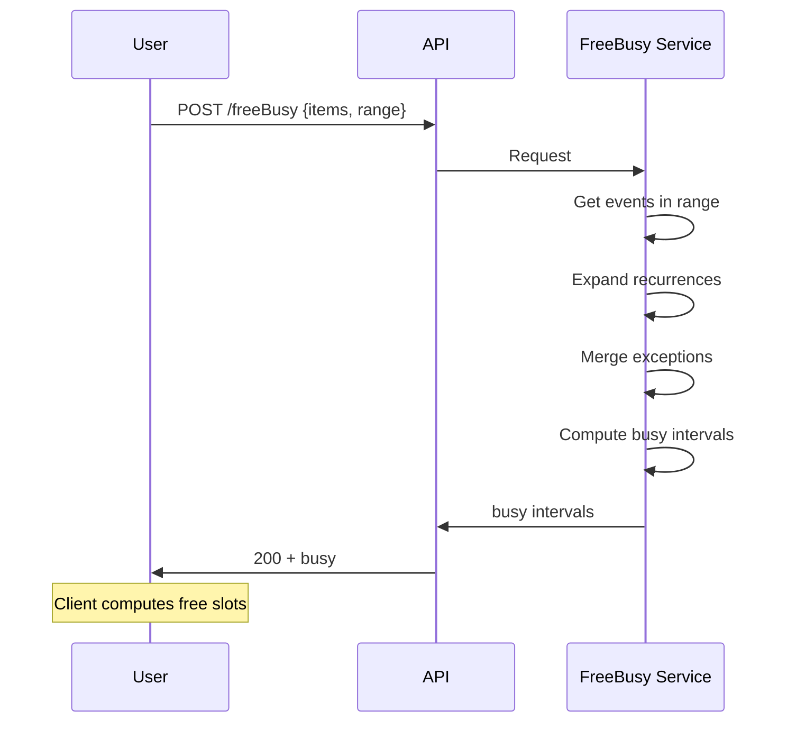
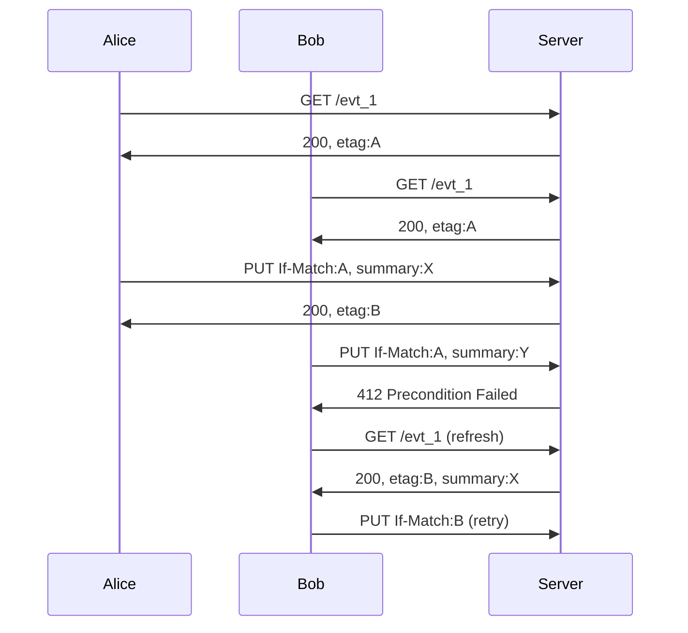

# Google Calendar — System Design Deep Dive

**Focus**: Recurring Events, Conflict Detection, Concurrency, Permissions

---

## Step 0: Clarifying Questions (3–5 min)

| Question | Answer |
|---|---|
| **Scope** | Personal + shared calendars (Google Calendar style) |
| **Users** | Individuals + organizations (B2C + B2B, Google Workspace) |
| **Scale** | ~1B+ users, hundreds of millions DAU |
| **Client types** | Web, Android, iOS, third-party via REST API |
| **Key challenges** | Recurring events, conflict detection, concurrent edits, RSVP for series |
| **Interoperability** | Must integrate with Outlook, Apple Calendar via CalDAV export/import |

---

## Step 1: Functional Requirements

### ✅ Core Use Cases

1. **CRUD events** — Create, read, update, delete
2. **Recurring events** — Daily, weekly, monthly, custom RRULE
3. **Instance modifications** — Edit/cancel one occurrence or "this and future"
4. **RSVP** — Accept/decline/tentative for single and recurring events
5. **Conflict detection** — Find free time slots across calendars
6. **Calendar sharing** — Read/write at calendar level
7. **Event invitations** — Invite attendees, track responses
8. **Notifications** — Assume a notification system exists; integrate with it

### ❌ Out of Scope

- Video conferencing (integration only)
- Full-text search at scale (Elasticsearch)
- Offline-first sync (simplify for interview)

---

## Step 2: Non-Functional Requirements & Estimations

### Quality Attributes

| Attribute | Target | Rationale |
|---|---|---|
| **Availability** | 99.99% | Critical productivity tool |
| **Consistency** | Strong for event writes; Eventual for notifications | Users must see correct calendar state |
| **Read Latency** | p99 < 50ms | Month-view, search |
| **Write Latency** | p99 < 200ms | Event creation/update |
| **Conflict detection** | < 500ms | Free/busy queries for scheduling |

### Back-of-Envelope Estimations

```
Users:      1B total, 500M DAU
Events:     ~5 events/user/week → ~350M writes/day → ~4K writes/sec (peak ~20K)
Reads:      500M × 5 views/day / 86400 ≈ 30K reads/sec (peak ~150K)
Free/busy:  Scheduling flows → ~10K QPS peak
Storage:    1B users × 500 events × 2KB ≈ 1 PB (grows ~200 TB/year)
```

---

## Step 3: API Design & Protocols

> **Interview framing**: "I'll propose a REST API. We version at the path (`/api/v1/`) so we can evolve without breaking clients. I'll model resources around calendars and events, and add a dedicated endpoint for free/busy since it's a distinct read pattern."

### Protocol Choice

| Protocol | Verdict | Why? |
|---|---|---|
| **REST (JSON)** | ✅ **Primary** | Resource-oriented, cacheable, easy to consume. Fits calendar semantics (events, calendars as resources). |
| **gRPC** | ✅ **Internal** | For service-to-service calls (e.g., Event Service → FreeBusy Service); lower latency, streaming. |
| **CalDAV** | ⚠️ **Interop** | Industry standard (RFC 4791); use for sync with Apple/Outlook if needed. Different design—HTTP+XML. |

### Proposed REST API

**Base**: `https://api.example.com/api/v1`

*Why version in path?* Lets us run v1 and v2 in parallel, deprecate gracefully. Query params (`?version=2`) or headers are alternatives; path is explicit and cache-friendly.

---

#### 1. Create Event

| | |
|---|---|
| **Method** | `POST` |
| **Path** | `/calendars/{calendarId}/events` |
| **Purpose** | Create a single or recurring event. Calendar is the parent resource—events belong to a calendar. |

**Request body**:
```json
{
  "summary": "Weekly standup",
  "start": { "dateTime": "2025-02-24T10:00:00", "timeZone": "America/Los_Angeles" },
  "end":   { "dateTime": "2025-02-24T10:30:00", "timeZone": "America/Los_Angeles" },
  "recurrence": ["RRULE:FREQ=WEEKLY;UNTIL=20251231T235959Z"],
  "attendees": [{ "email": "bob@example.com" }]
}
```

**Success response** `201 Created`:
```json
{
  "id": "evt_abc123",
  "etag": "\"xyz789\"",
  "status": "confirmed",
  "created": "2025-02-20T12:00:00Z",
  "updated": "2025-02-20T12:00:00Z",
  "summary": "Weekly standup",
  "start": { ... },
  "end": { ... },
  "recurrence": [ ... ],
  "organizer": { "email": "alice@example.com" },
  "attendees": [ { "email": "bob@example.com", "responseStatus": "needsAction" } ]
}
```

**Why `201`?** REST: create → 201 with `Location` header. `etag` is returned for later optimistic updates. `id` is opaque, globally unique.

**Errors**: `400` invalid payload, `403` no write access to calendar, `404` calendar not found.

---

#### 2. Get Event

| | |
|---|---|
| **Method** | `GET` |
| **Path** | `/calendars/{calendarId}/events/{eventId}` |
| **Purpose** | Fetch one event by ID. |

**Request**: No body. Optional query: `?expandRecurrence=true` to expand instances in a range (or we use a separate instances endpoint).

**Success response** `200 OK`: Same shape as create response. Includes `etag` in body and `ETag` header.

**Conditional GET**: Client sends `If-None-Match: "xyz789"`. If unchanged → `304 Not Modified` (saves bandwidth).

**Errors**: `404` not found, `403` no access.

---

#### 3. Update Event

| | |
|---|---|
| **Method** | `PUT` or `PATCH` |
| **Path** | `/calendars/{calendarId}/events/{eventId}` |
| **Purpose** | Update event. `PUT` = full replace, `PATCH` = partial. |

**Request headers**: `If-Match: "xyz789"` — required for optimistic concurrency. See Deep Dive 6.6.

**Request body** (PATCH example):
```json
{ "summary": "Weekly sync (updated)" }
```

**Success response** `200 OK`: Updated event with new `etag`.

**Error** `412 Precondition Failed`: Someone else updated the event. Client must refetch and retry.

---

#### 4. Delete Event

| | |
|---|---|
| **Method** | `DELETE` |
| **Path** | `/calendars/{calendarId}/events/{eventId}` |
| **Purpose** | Remove event. For recurring, `eventId` can be an instance ID to delete one occurrence. |

**Request**: Optional `If-Match` for conditional delete.

**Success** `204 No Content` (no body).

**Errors**: `404`, `403`, `412` (concurrent change).

---

#### 5. List Events (with optional range)

| | |
|---|---|
| **Method** | `GET` |
| **Path** | `/calendars/{calendarId}/events` |
| **Purpose** | List events in a time range. Core read path for calendar view. |

**Query params**:
| Param | Purpose |
|-------|---------|
| `timeMin` | Start of range (RFC3339) |
| `timeMax` | End of range |
| `singleEvents` | If `true`, expand recurring into instances (otherwise return master + exceptions) |
| `pageToken` | Cursor for pagination |

**Success response** `200 OK`:
```json
{
  "items": [ { "id": "...", "summary": "...", ... } ],
  "nextPageToken": "abc",
  "summary": "primary"
}
```

**Design choice**: Range in query, not path—`/events?timeMin=...&timeMax=...` keeps the resource model clean. Pagination via cursor (`nextPageToken`) for stable results when data changes.

---

#### 6. List Recurring Event Instances

| | |
|---|---|
| **Method** | `GET` |
| **Path** | `/calendars/{calendarId}/events/{recurringEventId}/instances` |
| **Purpose** | Get expanded instances of a recurring event. Needed to "edit one" or "edit this and following." |

**Query params**: `timeMin`, `timeMax` — which instances to return.

**Success response** `200 OK`:
```json
{
  "items": [
    {
      "id": "evt_abc123_20250224T100000",
      "recurringEventId": "evt_abc123",
      "originalStartTime": { "dateTime": "2025-02-24T10:00:00" },
      "start": { "dateTime": "2025-02-24T10:00:00" },
      "end": { ... },
      "status": "confirmed"
    }
  ]
}
```

**Why separate endpoint?** Instances are a different resource—derived, not stored as rows. Keeps `/events` simple; instances are a projection of recurrence + overrides.

---

#### 7. Respond to Invitation (RSVP)

| | |
|---|---|
| **Method** | `POST` |
| **Path** | `/calendars/{calendarId}/events/{eventId}/respond` |
| **Purpose** | Attendee accepts/declines. For recurring, optionally `?instanceId=...` for per-instance response. |

**Request body**:
```json
{ "responseStatus": "accepted" }
```
Values: `accepted`, `declined`, `tentative`.

**Success** `200 OK`: Event with updated attendee list. Organizer gets notified (via our notification system).

---

#### 8. Query Free/Busy (Conflict Detection)

| | |
|---|---|
| **Method** | `POST` |
| **Path** | `/freeBusy` |
| **Purpose** | Return busy intervals for given calendars in a range. Used for "find a time" and conflict checks. |

**Why POST, not GET?** Request body contains a list of calendar IDs—can be long. GET with query string would hit length limits; POST body is unbounded.

**Request body**:
```json
{
  "timeMin": "2025-02-24T00:00:00Z",
  "timeMax": "2025-03-03T23:59:59Z",
  "items": [
    { "id": "alice@example.com" },
    { "id": "bob@example.com" }
  ]
}
```

**Success response** `200 OK`:
```json
{
  "calendars": {
    "alice@example.com": {
      "busy": [
        { "start": "2025-02-24T10:00:00Z", "end": "2025-02-24T11:00:00Z" }
      ]
    },
    "bob@example.com": {
      "busy": [
        { "start": "2025-02-24T14:00:00Z", "end": "2025-02-24T15:00:00Z" }
      ]
    }
  }
}
```

**Client use**: Invert busy intervals → free slots. Intersect free slots across calendars → suggest meeting times.

**Design choice**: Return only busy intervals (not full event details). Reduces payload; free/busy doesn't need titles/locations. Caller must have `freeBusyReader` or stronger on each calendar.

**Industry equivalent**: CalDAV `free-busy-query` (RFC 6638), iTIP `VFREEBUSY`—same idea.

---

## Step 4: Data Model & Database Design

### Interview Sufficiency: What Level of Detail?

| Level | What Interviewer Expects |
|---|---|
| **Basic** | 3–4 core tables, main FKs, "events belong to calendars" |
| **Solid** | All tables, relationships, at least 2–3 query patterns explained |
| **Staff** | Field-by-field rationale, trade-offs, why we chose X over Y, query patterns with pros/cons |

**Is this sufficient?** Yes, if you can: (1) draw the schema from memory, (2) justify each relationship, (3) name the top 5 query patterns and how the schema supports them, (4) argue pros/cons of key design choices.

---

### 4.0 Build from Basics (Layered Approach)

**Level 1 — Minimal viable schema**:
```
users  ──1:N──>  calendars  ──1:N──>  events
```
*One user has many calendars. One calendar has many events.*

**Level 2 — Add recurrence & exceptions**:
```
events  ──1:N──>  event_instances   (overrides only; normal instances derived from RRULE)
```
*Recurring events produce instances; we store only exceptions.*

**Level 3 — Add collaboration**:
```
calendars  ──1:N──>  calendar_acl      (who can access this calendar)
events     ──1:N──>  event_attendees   (who's invited)
events     ──1:N──>  attendee_responses (RSVP per event/instance)
```

---

### 4.1 Database Choice

| Option | Pros | Cons |
|---|---|---|
| **SQL (Postgres/Spanner)** | ACID, joins, FKs, strong consistency | Harder to scale writes; sharding complexity |
| **Wide-column (Bigtable)** | Great for time-range scans; scales horizontally | No joins; denormalization required |
| **Document (MongoDB)** | Flexible schema; event as JSON | Weak range queries; no FK integrity |
| **Hybrid (SQL + time-series)** | SQL for metadata, wide-column for event blobs | Two systems to operate |

**Choice**: SQL (Spanner-style) for primary store. Events have relational semantics (calendar→event, event→attendees). Range queries (`events where start_ts BETWEEN ? AND ?`) are indexable. At hyperscale, add a denormalized time-range index keyed by `(calendar_id, start_ts)`.

**Concepts to know**: CAP, consistency vs. availability, when to denormalize.

---

### 4.2 Table Definitions: Every Field Explained

#### Table: `users`

| Field | Type | Why It Exists |
|---|---|---|
| `id` | UUID PK | Stable identity; email can change |
| `email` | VARCHAR UNIQUE | Login, invite targeting, uniqueness |
| `display_name` | VARCHAR | Shown in "Organizer: Alice", attendee lists |
| `created_at` | TIMESTAMP | Audit, analytics |

**Relationship**: Users own calendars. We need users before we can have calendar ownership.

---

#### Table: `calendars`

| Field | Type | Why It Exists |
|---|---|---|
| `id` | UUID PK | Opaque ID for API; hides internal structure |
| `owner_id` | FK → users | Who controls this calendar; used for permission checks |
| `name` | VARCHAR | "Work", "Personal" — user-facing label |
| `color` | VARCHAR | UI: hex or color name for calendar stripe |
| `timezone` | VARCHAR | Default for events without explicit TZ (e.g. "America/Los_Angeles") |
| `sync_token` | INT/BIGINT | Incremented on every change; used for **delta sync** (client: "give me changes since token N"). See §4.5a. |
| `created_at` | TIMESTAMP | Audit |

**Relationship**: `calendars.owner_id → users.id`. One user, many calendars. Why? Users have "Work", "Personal", shared team calendars—each is a distinct container.

---

#### Table: `calendar_acl` (Access Control List)

| Field | Type | Why It Exists |
|---|---|---|
| `id` | UUID PK | |
| `calendar_id` | FK → calendars | Which calendar this rule applies to |
| `scope_type` | ENUM | "user" \| "group" \| "domain" \| "public" — who gets access |
| `scope_value` | VARCHAR | User ID, group ID, domain, or "*" for public |
| `role` | ENUM | "owner" \| "writer" \| "reader" \| "freeBusyReader" — level of access |
| `created_at` | TIMESTAMP | Audit |

**Relationship**: `calendar_acl.calendar_id → calendars.id`. One calendar, many ACL entries. Why? A calendar can be shared with multiple users/groups at different permission levels.

| Pros | Cons |
|---|---|
| Fine-grained sharing (read vs write vs freeBusy) | ACL checks on every read; need indexing |
| Standard RBAC model | Recursive "group" resolution can be complex |

---

#### Table: `events`

| Field | Type | Why It Exists |
|---|---|---|
| `id` | UUID PK | Opaque event ID; used in URLs and instance IDs |
| `calendar_id` | FK → calendars | Event belongs to one calendar; scopes all queries |
| `uid` | VARCHAR UNIQUE | iCal UID; for interoperability (CalDAV, import/export). Survives move across calendars |
| `organizer_id` | FK → users | Who created/invited; used for "Organizer" display and permission (organizer can always edit) |
| `summary` | VARCHAR | Event title |
| `description` | TEXT | Body; can be long |
| `location` | VARCHAR | Place or video link |
| `start_ts` | TIMESTAMP | Start time (stored in UTC; display uses timezone) |
| `end_ts` | TIMESTAMP | End time |
| `timezone` | VARCHAR | For floating/recurring: "America/Los_Angeles" so "10am weekly" stays 10am local across DST |
| `recurrence` | JSONB | Array of RRULE strings, e.g. `["RRULE:FREQ=WEEKLY;UNTIL=20251231T235959Z"]`. Null = single event |
| `first_occurrence_ts` | TIMESTAMP | **Denormalized**. First instance start. Enables range query: `WHERE first_occurrence_ts < range_end` |
| `last_occurrence_ts` | TIMESTAMP | **Denormalized**. Last instance end. Enables: `WHERE last_occurrence_ts > range_start` |
| `status` | ENUM | "confirmed" \| "cancelled" \| "tentative" — cancelled = soft delete for the series |
| `etag` | VARCHAR | Hash or version; changes on every update. Used for **optimistic locking** (client sends `If-Match: etag`; server returns 412 if stale). See §4.5a. |
| `created_at` | TIMESTAMP | Audit |
| `updated_at` | TIMESTAMP | Audit; also for "last modified" display |

**Relationship**: `events.calendar_id → calendars.id`. One calendar, many events. All event queries are scoped by calendar → enables sharding by `calendar_id`.

**Denormalization (`first_occurrence_ts`, `last_occurrence_ts`)**:

| Pros | Cons |
|---|---|
| Range queries without expanding RRULE | Must keep in sync on insert/update |
| Index: `(calendar_id, first_occurrence_ts, last_occurrence_ts)` | Writes slightly more complex |
| Bounded index scan for "events in February" | Cannot represent infinite recurrence (use MAX_DATE cap) |

---

#### Table: `event_instances` (Exceptions Only)

| Field | Type | Why It Exists |
|---|---|---|
| `id` | UUID PK | Instance ID; used when editing/deleting "this occurrence only" |
| `recurring_event_id` | FK → events | Parent recurring event |
| `original_start_ts` | TIMESTAMP | RECURRENCE-ID; identifies which occurrence (e.g. "Feb 17 10am") |
| `start_ts` | TIMESTAMP | Actual start if rescheduled; else same as original |
| `end_ts` | TIMESTAMP | Actual end if rescheduled |
| `status` | ENUM | "cancelled" \| "modified" — cancelled = skip this instance when expanding |
| `summary` | VARCHAR | Override title for this instance only (optional) |
| `etag` | VARCHAR | Same as events: optimistic locking for updates to this instance (If-Match). See §4.5a. |
| `created_at`, `updated_at` | TIMESTAMP | Audit |

**Relationship**: `event_instances.recurring_event_id → events.id`. One recurring event, many instance overrides. We store *only* exceptions; normal instances are computed from RRULE.

| Pros | Cons |
|---|---|
| No row explosion (exceptions are rare) | Read logic must merge RRULE expansion + overrides |
| Storage efficient | "This and future" requires split (see Deep Dive 6.3) |

---

#### Table: `event_attendees`

| Field | Type | Why It Exists |
|---|---|---|
| `id` | UUID PK | |
| `event_id` | FK → events | Which event (or recurring base) |
| `user_id` | FK → users | Who is invited |
| `optional` | BOOLEAN | If true, "optional attendee" — affects scheduling UI differently |

**Relationship**: `event_attendees.event_id → events.id`. M:N between events and users via join table. One event, many attendees; one user can be on many events.

---

#### Table: `attendee_responses`

| Field | Type | Why It Exists |
|---|---|---|
| `id` | UUID PK | |
| `event_id` | FK → events | For series-level RSVP |
| `event_instance_id` | FK → event_instances, NULLABLE | For per-instance RSVP; NULL = series-level |
| `attendee_id` | FK → users | Who responded |
| `response_status` | ENUM | "accepted" \| "declined" \| "tentative" \| "needsAction" |
| `responded_at` | TIMESTAMP | When they replied |

**Relationship**: Links to both `events` and `event_instances`. Instance-level row overrides series-level when both exist. Why both? Most users "Accept all"; power users need "Decline Feb 17 only."

---

### 4.3 Relationships: Why Each Exists

| Relationship | Why |
|---|---|
| **users 1:N calendars** | A user owns multiple calendars (Work, Personal, shared). Ownership determines who can delete calendar or change ACL. |
| **calendars 1:N calendar_acl** | Sharing is per-calendar. ACL entries grant read/write/freeBusy to users, groups, or domains. |
| **calendars 1:N events** | Events live in a calendar. Scoping by calendar enables sharding and "show my Work calendar" queries. |
| **events 1:N event_instances** | Recurring events have exceptions. Storing only exceptions avoids storing every instance. |
| **events 1:N event_attendees** | M:N: events invite users; users get many invites. Join table allows extra fields (optional, response). |
| **events/instances 1:N attendee_responses** | RSVP is per-event or per-instance. Separate table allows multiple responses (e.g. series + one instance override). |
| **events.organizer_id → users** | Organizer has special rights (edit, delete, invite). Denormalized for fast "who organized this" without join. |

---

### 4.4 Frequent Query Patterns

| Query | SQL (conceptual) | How Schema Supports | Pros | Cons |
|---|---|---|---|---|
| **Q1: List events in range** | `SELECT * FROM events WHERE calendar_id=? AND last_occurrence_ts>? AND first_occurrence_ts<?` | `first/last_occurrence_ts` + composite index | Fast; no RRULE expansion | May return events with no instances in range; post-filter needed |
| **Q2: Get event by ID** | `SELECT * FROM events WHERE id=?` | PK lookup | O(1) | — |
| **Q3: Free/busy** | Expand RRULE for events in range, merge with event_instances, union busy intervals | Events + instances | Single source of truth | RRULE expansion CPU-heavy; consider caching |
| **Q4: Delta sync** | `SELECT * FROM calendar_changes WHERE calendar_id=? AND sync_token>?` | `sync_token` + change log table | Client fetches only changes | Change log grows; need compaction |
| **Q5: Attendees + RSVP** | Join events→event_attendees→users; left join attendee_responses | Normalized; instance overrides series | Correct precedence | Two joins per event |
| **Q6: Instances of recurring** | Expand RRULE; LEFT JOIN event_instances ON original_start_ts; apply overrides | event_instances | Minimal storage | Expansion + merge in app layer |
| **Q7: Can user edit?** | Check calendar_acl for user/group; role IN (owner, writer) | ACL + role | Flexible sharing | Group resolution; cache ACL for hot calendars |

**Index recommendations**:
- `events(calendar_id, first_occurrence_ts, last_occurrence_ts)` — range queries
- `events(calendar_id, updated_at)` — delta sync
- `event_instances(recurring_event_id, original_start_ts)` — lookup overrides
- `calendar_acl(calendar_id, scope_type, scope_value)` — permission check

---

### 4.5 Design Choice Summary: Pros & Cons

| Choice | Pros | Cons |
|---|---|---|
| **Store RRULE, not instances** | No row explosion; simple writes | Read must expand; free/busy expensive |
| **Store only exceptions** | Minimal storage; exceptions rare | Merge logic; "this and future" = split |
| **Denormalize first/last occurrence** | Fast range queries; indexable | Must maintain on write; infinite = cap |
| **Separate attendee_responses** | Series + instance RSVP; clear precedence | Extra join; nullable event_instance_id |
| **ACL on calendar, not event** | Simpler; most sharing is calendar-level | Per-event sharing would need event_acl |
| **etag for optimistic locking** | No locks; works across replicas | Client must handle 412 and retry |

---

### 4.5a sync_token vs etag: Two Different Versioning Mechanisms

These are often confused because both are "version" fields. They solve different problems.

#### sync_token (on `calendars`)

**What it is**: A monotonic counter that increments whenever *any* event in that calendar is created, updated, or deleted.

**Where it lives**: `calendars.sync_token` — one value per calendar.

**What it's used for**: **Delta sync** ("give me only what changed since I last synced").

| Step | Client | Server |
|---|---|---|
| 1 | `GET /calendars/{id}/events?syncToken=42` | Returns events changed since token 42, plus new `sync_token=47` |
| 2 | Client stores 47 | |
| 3 | Next sync: `GET ...?syncToken=47` | Returns only changes since 47 |

**Implementation**: You need a `calendar_changes` log: `(calendar_id, sync_token, event_id, operation)`. On every event write, increment `calendars.sync_token` and append to the log. Delta query = `SELECT ... FROM calendar_changes WHERE calendar_id=? AND sync_token > ?`.

**Scope**: Calendar-level. Answers "what changed in this calendar?"

---

#### etag (on `events` and `event_instances`)

**What it is**: An opaque string (often a hash of the payload or a version number) that changes whenever *that specific event* is modified.

**Where it lives**: `events.etag`, `event_instances.etag` — one value per event/instance.

**What it's used for**: **Optimistic locking** ("update only if no one else changed it").

| Step | Client | Server |
|---|---|---|
| 1 | `GET /events/evt_123` | Returns event with `etag: "abc"` |
| 2 | User edits locally | |
| 3 | `PUT /events/evt_123` + header `If-Match: "abc"` | Server compares: current etag == "abc"? |
| 4a | Yes | Apply update, return 200 + new etag |
| 4b | No (someone else updated) | Return **412 Precondition Failed** — client must refetch and retry |

**Why "optimistic"?** We assume conflicts are rare. No lock is taken. If two users edit at once, the second write fails with 412; client refetches the latest, reapplies the user's changes, and retries.

**Scope**: Event-level. Answers "has this specific event changed since I last read it?"

---

#### Where each is used in this design

| Use case | Mechanism | Table |
|---|---|---|
| Delta sync ("what changed since last sync?") | `sync_token` | `calendars` |
| Conditional GET ("has this event changed?") | `etag` + `If-None-Match` | `events` |
| Optimistic update ("update only if unchanged") | `etag` + `If-Match` | `events`, `event_instances` |
| Concurrent edit conflict | Server returns 412 when etag mismatch | `events` |

**Summary**: `sync_token` = calendar-wide change cursor for incremental sync. `etag` = per-resource version for optimistic concurrency on writes.

---

### 4.6 Schema Diagram (Full)



---

### 4.7 Scenario: Single Recurring Event (No Modifications)

```
events
┌────────────────────────────────────────────────────────────────┐
│ id: evt_abc  summary: "Weekly Sync"  recurrence: [RRULE:WEEKLY] │
│ first_occurrence: 2025-02-03 10:00  last_occurrence: 2025-12-31 │
└────────────────────────────────────────────────────────────────┘

event_instances: (empty) — instances are expanded on read or from index
```

#### 4.8 Scenario: One Instance Cancelled

```
events (unchanged)
event_instances
┌─────────────────────────────────────────────────────────────────────────┐
│ recurring_event_id: evt_abc  original_start_ts: 2025-02-17 10:00        │
│ status: cancelled                                                        │
└─────────────────────────────────────────────────────────────────────────┘
```

**Design choice**: Store only *exceptions*. Normal instances are derived from RRULE.

| Pros | Cons |
|---|---|
| No row explosion for long series | Range queries need to merge RRULE expansion + overrides |
| Minimal storage | Server must expand RRULE for free/busy |
| Matches iCalendar RECURRENCE-ID model | Complex logic for "this and future" |

#### 4.9 Scenario: Series Edited Mid-Range ("This and Future")

```
BEFORE: Weekly Sync every Mon 10am (Jan–Dec)
User edits "from Feb 17 onward" → new location "Building B"

AFTER (Google's approach — 2 API calls):

1) TRIM original event:
events (evt_abc)
  recurrence: RRULE:FREQ=WEEKLY;UNTIL=20250216T175959Z  (ends day before first changed)

2) INSERT new recurring event:
events (evt_xyz)
  summary: "Weekly Sync"
  start: 2025-02-17 10:00
  recurrence: RRULE:FREQ=WEEKLY;UNTIL=20251231...
  location: "Building B"
  (linked for UI: original_event_id: evt_abc — optional)
```

**Why this approach?**

| Pros | Cons |
|---|---|
| Clear semantics: two independent series | Client must perform 2 requests; risk of partial failure |
| No complex RANGE=THISANDFUTURE in DB | Need to handle linking in UI (e.g., "Series split") |
| Reuses same storage model | |

**Industry standard**: RFC 5545 `RECURRENCE-ID` with `RANGE=THISANDFUTURE` can represent this in iCalendar; backend may still split into two logical events for simpler querying.

#### 4.10 DB Diagram: How Different Scenarios Are Stored

```
SCENARIO A: Single event, no recurrence
──────────────────────────────────────
events:     [evt_1: summary="Meeting", recurrence=null, start/end]
instances:  (none)


SCENARIO B: Recurring, no modifications
──────────────────────────────────────
events:     [evt_2: recurrence=[RRULE:WEEKLY], first=Feb3, last=Dec31]
instances:  (none) — expand from RRULE on read


SCENARIO C: One instance cancelled (Feb 17)
──────────────────────────────────────
events:     [evt_2: (unchanged)]
instances:  [ {recurring_id: evt_2, original_start: Feb17 10:00, status: cancelled} ]

Read: When expanding, skip instances with status=cancelled override.


SCENARIO D: Series edited from Feb 17 onward
──────────────────────────────────────
events:     [evt_2: UNTIL=Feb16 23:59:59]              ← trimmed
            [evt_3: start=Feb17, RRULE:WEEKLY, loc="B"] ← new
instances:  (none)

UI links evt_2 + evt_3 as "split series" for display.
```

---

## Step 5: High-Level Architecture

### Interview Sufficiency: Will This Get You Through?

| What Interviewers Look For | Covered? |
|---|---|
| Start simple, then add complexity | ✅ Build from 3 boxes → full system |
| Justify every component | ✅ "Why we need X" for each addition |
| Show data flow | ✅ Request paths, async flows |
| Mention scaling / redundancy | ✅ LB, multiple service instances, DB replicas |
| Acknowledge what you'd add later | ✅ CDN, tracing, rate limiting |

**Reality check**: In a 45-min interview, you might only draw up to "Level 2" on the whiteboard. The full diagram is for when they say "now add caching" or "how would you scale this?" — you extend incrementally.

---

### 5.0 Build Incrementally: Start Small, Add Components

**Level 0 — Bare minimum (3 boxes)**



| Component | Why we need it |
|---|---|
| **Client** | Web, mobile, third-party apps. Entry point for all traffic. |
| **API Server** | Single service handling CRUD, auth, business logic. |
| **Database** | Persistent store for events, calendars, users. |

**Interview tip**: "I'll start with the simplest possible architecture, then add components as we hit scale or new requirements."

---

**Level 1 — Add Load Balancer + multiple API instances**



| Component | Why we add it |
|---|---|
| **Load Balancer** | Distributes traffic across API instances. Single API is a SPOF; at 10K+ QPS one box can't handle it. LB also terminates TLS. |
| **Multiple API instances** | Horizontal scaling. Add more when load grows; stateless so any instance can serve any request. |

---

**Level 2 — Split into services (Event, FreeBusy, Notification)**



| Component | Why we add it |
|---|---|
| **Event Service** | CRUD, recurrence, instances. Core domain logic. Separating it lets us scale event writes independently. |
| **FreeBusy Service** | Conflict detection, "find a time". Different read pattern: range queries, RRULE expansion. Can cache aggressively; scale separately from writes. |
| **Notification Service** | Invites, reminders, updates. Async by nature—we don't block the user on "email sent." Decouples from Event Service via queue. |
| **Message Queue (e.g. Kafka, RabbitMQ, Pub/Sub)** | Event Service publishes "event_created", "event_updated"; Notification Service consumes and sends email/push. Buffers spikes; retries on failure. |

**Interview tip**: "I split by domain and by read/write pattern. FreeBusy is read-heavy and cacheable; Notifications are async."

---

**Level 3 — Add Cache and async Notification flow**



| Component | Why we add it |
|---|---|
| **Redis Cache** | FreeBusy and hot events. FreeBusy for "find a time" is expensive (RRULE expansion, multi-calendar). Cache by (calendar_ids, range) with short TTL (1–5 min). Event GET by ID also cached. |
| **Notification System (external)** | Email, push, in-app. We assume it exists; our Notification Service just calls its API. Keeps scope bounded. |

---

**Level 4 — Full system (with redundancy hints)**



| Component | Why we add it |
|---|---|
| **API Gateway (Auth, Rate Limit, Router)** | Auth: validate JWT/OAuth before hitting services. Rate limit: protect against abuse. Router: route `/events/*` → Event Service, `/freeBusy` → FreeBusy Service. |
| **DB Replica** | Read replicas for FreeBusy and event reads. Writes go to primary; reads can fan out to replicas. Reduces load on primary. |
| **Multiple instances** | ES, FB, NS each run as N instances behind internal LB. Not shown in diagram for clarity. |

---

### 5.1 Component Responsibilities

| Component | Responsibility | Scales with |
|---|---|---|
| **Load Balancer** | TLS termination, distribute traffic | Request rate |
| **API Gateway** | Auth, rate limit, route to services | Request rate |
| **Event Service** | CRUD events, recurrence, instances, ACL checks | Write QPS |
| **FreeBusy Service** | Range queries, RRULE expansion, busy intervals | Read QPS, # calendars in query |
| **Notification Service** | Consume events from queue, call notification API | Invite/reminder volume |
| **Event Store** | Source of truth; ACID | Storage, write QPS |
| **Cache** | Hot events, FreeBusy results | Read QPS |
| **Message Queue** | Buffer async work; decouple producers/consumers | Event volume |

---

### 5.2 Data Flows

| Flow | Path | Notes |
|---|---|---|
| **Create event** | Client → LB → Gateway → Event Service → DB. Event Service publishes to MQ. NS consumes → sends invites. | Sync write; async notifications |
| **List events in range** | Client → LB → Gateway → Event Service → DB (or Cache if we cache hot calendars) | Read path |
| **Free/busy query** | Client → LB → Gateway → FreeBusy Service → Cache? → DB (replica). Returns busy intervals. | Read-heavy; cache key = (calendars, range) |
| **Delta sync** | Client sends `sync_token`. Event Service queries change log, returns only changed event IDs. Client fetches those. | Reduces payload for mobile |
| **Concurrent update** | Both hit Event Service. One wins; other gets 412. Client refetches and retries. | Optimistic locking at DB/etag level |

---

### 5.3 Direct Diagrams: Mermaid vs ASCII vs Images

| Format | Pros | Cons |
|---|---|---|
| **Mermaid** (used above) | Renders as diagrams in GitHub, GitLab, VS Code, Notion. No external tools. Version-controlled. | Some viewers don't support it; syntax to learn |
| **ASCII** | Works everywhere; copy-paste into Slack, email, whiteboard notes | Hard to read for complex diagrams |
| **PNG/SVG images** | Full control over layout, design | Not version-friendly; need image host or repo bloat |

**Using Mermaid**: Wrap in ` ```mermaid ` code blocks. Most Markdown renderers will show boxes and arrows. If your viewer doesn't support it, you'll see the code—still understandable. For a real interview, draw on a whiteboard; these diagrams are for study and docs.

---

## Step 6: Deep Dives (Staff-Level)

### 6.1 How Do You Handle Recurring Events?

**Problem**: A weekly event could have hundreds of instances. Storing each as a row would explode storage and complicate updates.

**Why not store every instance?** Storage would grow O(instances × users). A daily event for 1 year = 365 rows per event. At 1B users × 100 recurring events = 36.5B rows. Updates to the series would require mass updates. **Concepts to know**: Normalization vs. denormalization, time-series storage patterns.

**Approach**: Store one row per logical event with RRULE; expand on read or via a precomputed index.

| Approach | Pros | Cons |
|---|---|---|
| **Store RRULE only, expand on read** | Minimal storage, simple writes | Heavy read cost for long series; free/busy needs expansion |
| **Pre-expand N instances** | Fast range queries, fast free/busy | Writes must update expansion; storage grows |
| **Hybrid** | Balance read/write | More complex logic |

**Google-style choice**: Store RRULE + `first_occurrence`, `last_occurrence` for indexing. Pre-expand or lazily expand for free/busy. Limit ~730 instances per series to bound cost.

**Concepts to know**: RRULE (RFC 5545), recurrence expansion algorithms, time complexity of expansion. **Industry standard**: RFC 5545 RRULE is the canonical format; CalDAV uses the same. Any system can interoperate via iCalendar export/import.

---

### 6.2 If One Instance Is Changed (Exception)

**Problem**: User cancels or reschedules only one occurrence (e.g., "Cancel Feb 17 only").

**Approach**: Create an **override** row in `event_instances` with:
- `recurring_event_id`
- `original_start_ts` (RECURRENCE-ID)
- `status: cancelled` or updated `start_ts`/`end_ts`

**Flow**:
1. Client calls `GET .../events/{recurringId}/instances` to get instances.
2. Client selects instance and sends `PUT .../events/{instanceId}` with `status: cancelled` (or updated fields).
3. Server creates/updates `event_instances` row; instances API merges overrides when expanding.

**Why not store every instance?** Storage and update cost. Exceptions are rare; storing only deltas is efficient.

**Concepts to know**: RECURRENCE-ID (RFC 5545), exception/override pattern. **Industry standard**: CalDAV and iCalendar use RECURRENCE-ID for this; same semantics.

---

### 6.3 Series Edited Mid-Range ("This and Future")

**Problem**: User changes location for "this and all future" instances.

**Approach**: Split into two events (Google's documented behavior):
1. **Trim** original: Update RRULE `UNTIL` to the day before the first changed instance.
2. **Insert** new: Create new recurring event starting at the first changed instance with new data.

| Pros | Cons |
|---|---|
| Clear semantics; two independent series | Client must perform 2 requests; risk of partial failure |
| No complex RANGE=THISANDFUTURE in DB | Need UI logic to link "split series" |
| Reuses same storage model | |

**User flow**:
```
User: Edit "Weekly Sync" from Feb 17 onward
  → UI shows: "Change this and following events?"
  → User confirms
  → Client: 1) PUT original with UNTIL=2025-02-16
            2) POST new event starting 2025-02-17
  → Notifications: Notify attendees of both changes (existing notification system)
```

**Industry standard**: iCalendar `RECURRENCE-ID` with `RANGE=THISANDFUTURE` can represent this in a single component; implementations may still normalize to two events internally.

---

### 6.4 RSVP for Recurring Events

**Problem**: Attendee can respond per instance ("Accept Feb 17, Decline Feb 24") or for the whole series ("Accept all").

**Data model**:

```
attendee_responses
├── event_id (recurring base) + NULL instance_id  → Series-level RSVP
└── event_instance_id (specific instance)         → Instance-level RSVP
```

**Precedence**: Instance-level overrides series-level when both exist.

**User flow**:
1. Invite for recurring event → Attendee gets one invite (or per-instance if configured).
2. Attendee clicks "Accept" → Store series-level response.
3. Attendee later declines one instance → Store instance-level response; that instance overrides.
4. Notification: Notify organizer of each response (via existing notification system).

**Why both levels?** UX: most users accept all; power users need per-instance control.

**Pros**: Flexible; supports "accept all" and per-instance. **Cons**: More complex read logic (merge series + instance responses). **Concepts to know**: iTIP PARTSTAT (RFC 5546) defines accepted/declined/tentative; industry standard for RSVP semantics.

---

### 6.5 Conflict Detection & Finding Free Time Slots

**Problem**: "Find a 1-hour slot when Alice, Bob, and Carol are free next week."

**Approach**:
1. **FreeBusy API**: `POST /freeBusy` with `items: [alice, bob, carol]`, `timeMin`, `timeMax`.
2. Server returns `busy` intervals per calendar.
3. Client inverts: free = (full range) − (union of busy).
4. Client finds first contiguous free slot ≥ desired duration.

**Algorithm (conceptual)**:
```
free_slots = [timeMin, timeMax]
for each calendar:
  for each busy (start, end):
    free_slots = subtract_interval(free_slots, (start, end))
return first interval in free_slots where length >= desired_duration
```

**Recurring events**: FreeBusy service expands RRULE + merges exceptions before computing busy intervals. This is the main reason to pre-expand or cache expansions for hot calendars.

**Industry standard**: CalDAV `free-busy-query` (RFC 6638), iTIP `VFREEBUSY` (RFC 5546). Semantics are equivalent. **Usage**: Scheduling UIs call this before suggesting times; "Find a time" features rely on it.

---

### 6.6 Concurrent Event Modifications (Optimistic Locking)

**Problem**: Alice and Bob edit the same event simultaneously. How to avoid lost updates?

**Approach**: **ETag-based optimistic concurrency** (HTTP standard).

| Step | Client | Server |
|---|---|---|
| 1 | `GET /events/evt_123` | Returns event + `ETag: "abc123"` |
| 2 | User edits locally | |
| 3 | `PUT /events/evt_123` + `If-Match: "abc123"` + body | Compare current ETag with "abc123" |
| 4a | Match | Apply update, return 200 + new ETag |
| 4b | No match (someone else updated) | Return 412 Precondition Failed |

**Conflict resolution (client)**:
1. On 412: `GET` latest version.
2. Merge or show conflict UI.
3. Retry `PUT` with new ETag.

**Why ETag over version number?**
- HTTP-native (`If-Match`, `If-None-Match`).
- Can be content hash; works for conditional GET (304 Not Modified) too.

**Why optimistic over pessimistic locking?**
- Calendars are low-conflict; blocking would hurt UX.
- Optimistic: no locks, good for distributed systems.

**Concepts to know**: Optimistic vs. pessimistic locking, ETags, 412 Precondition Failed. **API usage**: Google Calendar API documents `If-Match` for updates; clients must send `If-Match: <etag>` and handle 412 by refetching and retrying.

---

### 6.7 Permissions: Who Can Modify Events?

**Two layers**: Calendar-level (ACL) and event-level (organizer/attendee).

#### Calendar ACL (who can access the calendar)

| Role | Permissions |
|---|---|
| **owner** | Full control, manage ACL |
| **writer** | Create, edit, delete events; see private details |
| **reader** | See all events (subject to event visibility) |
| **freeBusyReader** | See only free/busy, no details |

#### Event-level

| Actor | Permissions |
|---|---|
| **Organizer** | Edit, delete, invite, change all attendees' copies |
| **Attendee (guest)** | Edit own copy (reminders, visibility); typically cannot change time/location for others |
| **Calendar writer** | Can edit events if they have calendar write access |

**Modification flow**:
```
User requests: PUT /events/evt_123
  → Auth: Resolve user identity
  → Check: Is user organizer? OR calendar writer? OR (attendee + guestsCanModify)?
  → If no: 403 Forbidden
  → If yes: Apply ETag check, then update
```

**Invitations**: Organizer controls `guestsCanInviteOthers`, `guestsCanModify`, `guestsCanSeeOtherGuests`.

---

### 6.8 Notifications (Assume System Exists)

**Integration points**: Assume a notification system exists (email, push, in-app). Event Service publishes to a message queue; Notification Worker consumes and calls the notification API.

| Event | Trigger | Notification |
|---|---|---|
| Event created with attendees | After event insert | Notify each attendee: "You were invited to X" |
| Event updated | After event update | Notify attendees: "Event X was updated" |
| Event cancelled | After status=cancelled | Notify attendees: "Event X was cancelled" |
| RSVP received | After attendee response | Notify organizer: "Alice accepted X" |
| Recurring instance changed | After instance override | Notify attendees for that instance |
| Series split | After trim + insert | Notify attendees for both affected series |

**User flow (invitation)**:
```
1. Organizer creates event with attendees
2. Event Service persists event
3. Event Service publishes to Message Queue: { type: "event_created", event_id, attendees }
4. Notification Worker consumes, calls Notification System API
5. Notification System sends email/push/in-app per user preferences
```

---

## Step 7: User Flows (End-to-End)

### Flow 1: Create Recurring Event with Attendees



### Flow 2: Find Free Time Slot



### Flow 3: Concurrent Edit (ETag Conflict)



---

## Step 8: Additional Staff-Level Topics

### 8.1 Timezone & DST

Recurring events can span DST changes. Store `timezone` (e.g. `America/Los_Angeles`) with the event; expand using that zone so "10am weekly" stays 10am local.

### 8.2 Sharding Strategy

Partition by `calendar_id` or `owner_id`. All events for a calendar live in the same shard → no cross-shard joins for common queries. FreeBusy across users requires fan-out to multiple shards.

### 8.2 Caching

- **Event cache**: Cache by `event_id`; invalidate on update (ETag change).
- **FreeBusy cache**: Short TTL (e.g. 1–5 min); acceptable staleness for scheduling.

### 8.3 Idempotency

Use idempotency keys for `POST /events` so retries do not create duplicates. Example: `Idempotency-Key: uuid` header.

---

## Summary: Concepts You Should Know

| Concept | Why It Matters |
|---|---|
| **RRULE, RECURRENCE-ID** | Core recurrence model (RFC 5545) |
| **CalDAV, iTIP** | Industry standards; interoperability |
| **ETag, optimistic locking** | Concurrent edits without locks |
| **Free/busy, VFREEBUSY** | Conflict detection |
| **ACL, RBAC** | Permissions model |
| **Eventual vs. strong consistency** | CAP, distributed systems |
| **Sharding by tenant (calendar)** | Scaling pattern |
| **Idempotency keys** | Safe retries |

---

## Open Questions for Interview Discussion

1. How would you design **offline-first sync** with conflict resolution?
2. How would you **pre-expand** recurrences for 1B users without blowing up storage?
3. How would you add **real-time collaboration** (multiple users editing same event)?
4. How would you **shard across regions** for global latency?
5. How would you handle **calendar subscriptions** (e.g. holidays) at scale?
