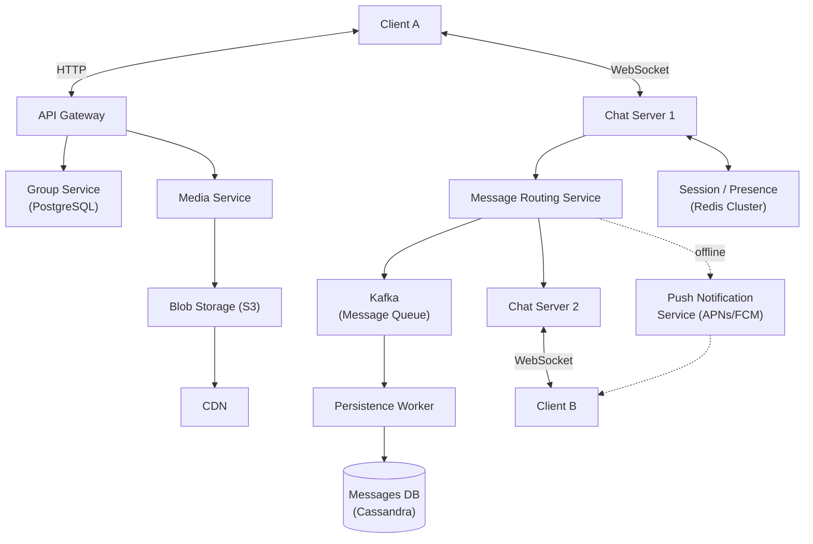
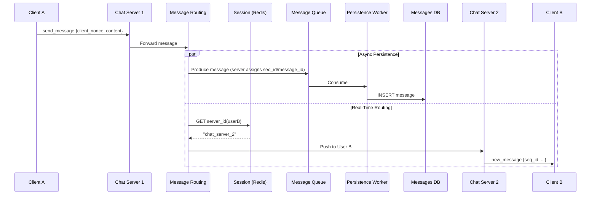
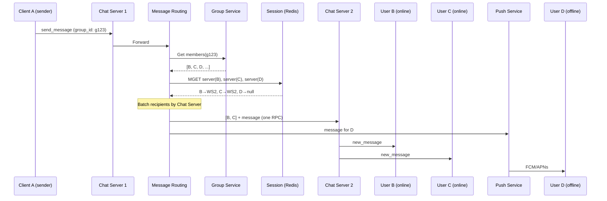
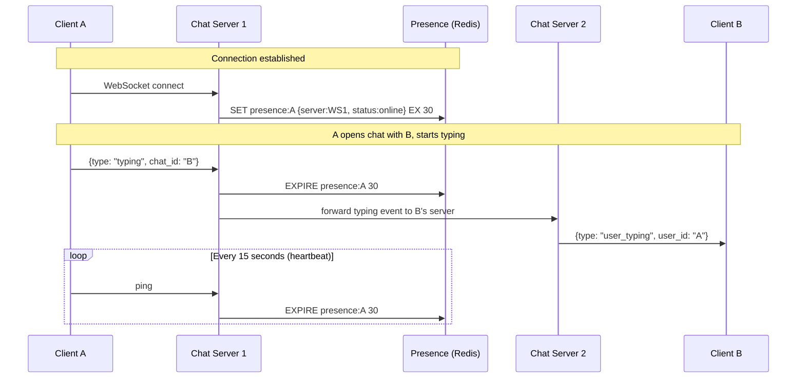
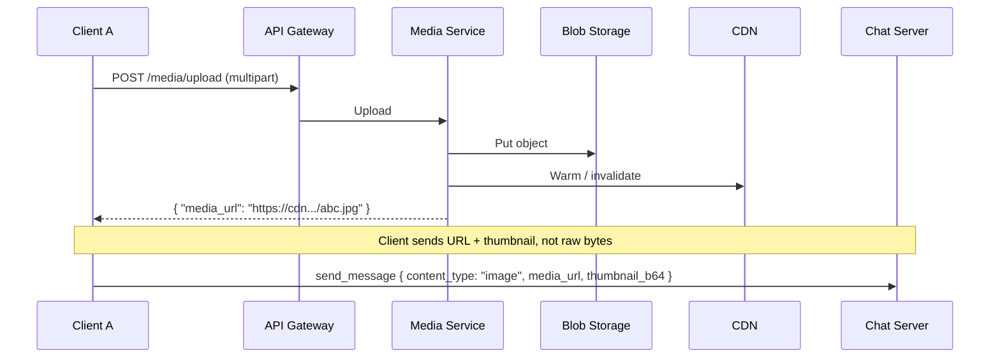
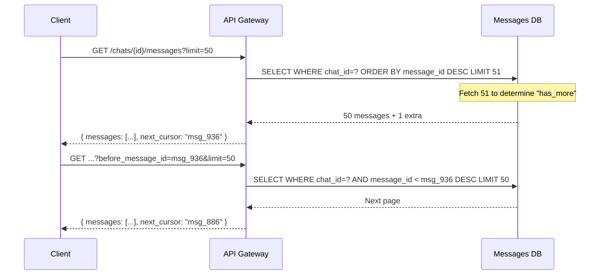
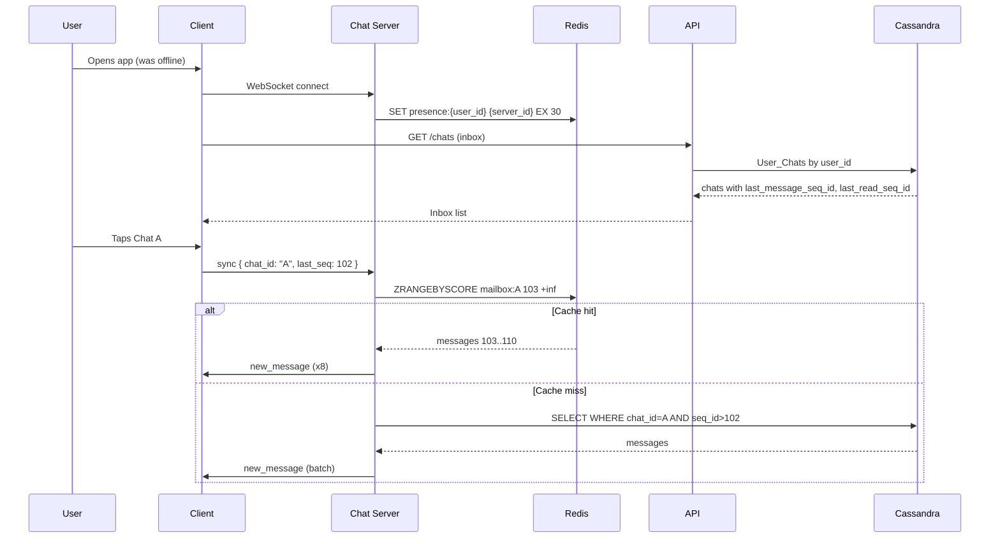
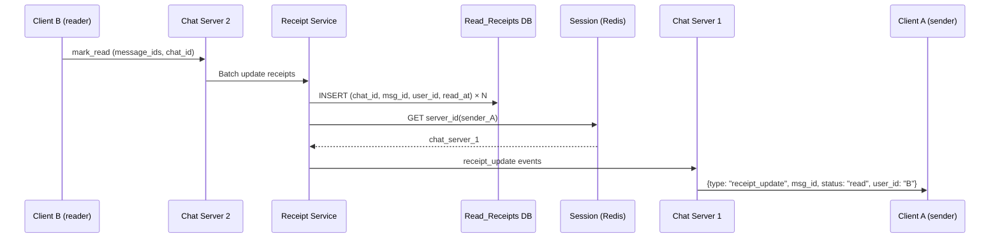

# WhatsApp-Scale Chat Application — System Design

*A one-stop reference for designing a WhatsApp-like real-time chat system at global scale. Use this for interview prep, architecture reviews, or as a blueprint for implementation.*

**Covers:** 1:1 & group chat · presence · read receipts · media · capacity planning · scale evolution (10× → 1000×) · multi-region · consistency · failure modes · flow diagrams · design trade-offs · production details (state sync, server-side sequencing, connection draining, unread counters, Cassandra tombstones, media thumbnails).

---

## Table of Contents

| # | Section |
|---|---------|
| 0 | [Clarifying Questions](#0-clarifying-questions) |
| 1 | [Functional Requirements](#1-functional-requirements) |
| 2 | [Non-Functional Requirements & Estimations](#2-non-functional-requirements--estimations) |
| 3 | [Capacity Planning](#3-capacity-planning) |
| 4 | [API Design](#4-api-design) |
| 5 | [Data Model & Schema](#5-data-model--schema) |
| 6 | [High-Level Architecture](#6-high-level-architecture) |
| 7 | [Flow Diagrams](#7-flow-diagrams) |
| 8 | [Deep Dive: Key Components](#8-deep-dive-key-components) |
| 9 | [Bottlenecks & Reliability](#9-bottlenecks--reliability) |
| 10 | [Design Decisions: Why & Why Not](#10-design-decisions-why--why-not) |
| 11 | [Scale Evolution](#11-scale-evolution) |
| 12 | [Multi-Region & Global Distribution](#12-multi-region--global-distribution) |
| 13 | [Consistency, Ordering & Failure Handling](#13-consistency-ordering--failure-handling) |
| 14 | [Read Receipts at Scale](#14-read-receipts-at-scale) |
| 15 | [Production Details](#15-production-details) |
| 16 | [Edge Cases & Operational Considerations](#16-edge-cases--operational-considerations) |
| 17 | [Quick Reference: Key Numbers](#17-quick-reference-key-numbers) |

---

## 0. Clarifying Questions

| Question | Answer |
|----------|--------|
| Chat types? | Both **1-on-1 and Group** chatting. |
| Features? | Text + Multimedia (Images, Videos). Read receipts, last seen, typing indicators — **all required**. |
| Multi-device sync? | **No.** Single device per user. |
| Scale? | **Very large, global** — test distributed system knowledge. Assume WhatsApp scale. |
| Data retention / E2EE? | Not a primary concern for now; depends on architecture. |

---

## 1. Functional Requirements

1. **1-on-1 Chat** — Users send and receive messages in real time.
2. **Group Chat** — Users send messages to a group; all members receive them in real time.
3. **Presence / Status** — Online indicator, "last seen" timestamp, typing indicators.
4. **Read Receipts** — Per-message status: Sent → Delivered → Read.
5. **Multimedia** — Images, videos, and voice notes alongside text.

**Out of Scope:** Multi-device sync · E2EE implementation details · Voice/Video calls.

---

## 2. Non-Functional Requirements & Estimations

### Quality Attributes

| Attribute | Target | Notes |
|-----------|--------|-------|
| **Latency** | < 100 ms end-to-end | Real-time feel; typing indicators especially sensitive. |
| **Availability** | 99.99% (~52 min downtime/year) | Individual delivery can be retried; connection can be re-established. |
| **Scalability** | 1 Billion+ users | Horizontal scaling required across all layers. |
| **Ordering** | Strict for 1-on-1; best-effort for groups | Server-side sequencing; never trust client clock. |

### Back-of-Envelope Estimations

| Metric | Calculation | Result |
|--------|-------------|--------|
| DAU | Given | **1 Billion** |
| Messages/day | 1B × 50 msg/user | **50 Billion** |
| Avg QPS | 50B / 86,400 | ~600,000 QPS |
| Peak QPS | Avg × 2 | **~1.2 Million QPS** |
| Concurrent connections | 1B × 20% online at peak | **~200M WebSocket connections** |
| Text storage/day | 50B × 100 B | ~5 TB/day |
| Media storage/day | 5B × 1 MB (10% media msgs) | ~5 PB/day |
| Bandwidth | 600K QPS × 200 B × 2 (send + receive) | **~240 GB/s → ~2 Tbps at peak** |
| Memory (connections) | 200M × 10 KB/connection | **~2 TB RAM** just for WebSocket state |

> **Implication:** We need a CDN for media, WebSocket gateways co-located per region to keep traffic local, and a horizontally partitioned database that can sustain 1.2M writes/sec.

---

## 3. API Design

**Protocol split:**
- **REST / HTTP** — Standard request-response: auth, group management, message history.
- **WebSocket** — Persistent, bidirectional: real-time send/receive, typing, receipts, presence.

### 3.1 REST Endpoints

All endpoints require `Authorization: Bearer <JWT>`.

**Create a Group**
```
POST /api/v1/groups
Body:  { "name": "...", "members": ["userA", "userB"] }
Response: { "group_id": "g123", "created_at": "..." }
```

**Fetch Message History** *(cursor-based pagination)*
```
GET /api/v1/chats/{chat_id}/messages?limit=50&before_message_id=msg987
Response:
{
  "messages": [
    { "message_id": "msg986", "seq_id": 105, "sender_id": "userA",
      "content_type": "text", "content": "Hello!", "created_at": "...", "status": "read" }
  ],
  "next_cursor": "msg936"
}
```
> `chat_id` = `group_id` for groups, or `userA_userB` (alphabetically sorted) for 1-on-1.
> Cursor over offset: `OFFSET N` in Cassandra requires scanning N rows — O(n). Cursor uses the clustering key range — O(log n). Always prefer cursor.

**Upload Media** *(before sending the message)*
```
POST /api/v1/media/upload
Body:  multipart/form-data
Response: { "media_url": "https://cdn.chat.com/media/abc.jpg" }
```
> Client also generates a small thumbnail (<2 KB Base64) to embed in the subsequent `send_message` WebSocket event. See [§15.6](#156-media-thumbnails--e2ee-implications).

### 3.2 WebSocket Events

Clients maintain one persistent WebSocket connection to a Chat Server for the lifetime of the session.

---

**Send a Message** `(Client → Server)`
```json
{
  "type": "send_message",
  "payload": {
    "chat_id": "userB",
    "content_type": "text",
    "content": "How are you?",
    "media_url": "https://cdn.../abc.jpg",
    "thumbnail_b64": "data:image/jpeg;base64,...",
    "client_nonce": "xyz123"
  }
}
```
> - `client_nonce` — deduplication token; same nonce from duplicate retries returns the same `message_id` and is not re-delivered.
> - `thumbnail_b64` — sender-generated tiny preview for media (<2 KB). Not present for text.
> - **Server assigns `message_id` and `seq_id`.** The client clock is never trusted.

---

**Receive a Message** `(Server → Client)`
```json
{
  "type": "new_message",
  "payload": {
    "message_id": "msg101",
    "seq_id": 105,
    "chat_id": "g123",
    "sender_id": "userA",
    "content_type": "text",
    "content": "Hello group!",
    "created_at": "...",
    "thumbnail_b64": null
  }
}
```
> `seq_id` = server-assigned monotonic sequence per chat. Recipients sort by `seq_id`, not `created_at`.

---

**Sync / Gap Recovery** `(Client → Server)` — *avoids DDOS on reconnect*
```json
{ "type": "sync", "chat_id": "userB", "last_seq": 105 }
```
> Server pushes only messages with `seq_id > 105`, served from **Redis mailbox** (recent messages, ~5 min TTL). Falls back to Cassandra only on cache miss. No full REST GET needed on reconnect.

---

**Reconnect Hint** `(Server → Client)` — *graceful deploys, zero downtime*
```json
{ "type": "reconnect_hint", "delay_ms": 3500 }
```
> `delay_ms` is random (1–10,000 ms). Client opens a new connection in background, flips over, closes old. Server drains without a thundering herd.

---

**Typing Indicator** `(bidirectional)`
- Client → Server: `{ "type": "typing", "chat_id": "userB" }`
- Server → Client: `{ "type": "user_typing", "user_id": "userA", "chat_id": "userB" }`

**Read Receipt** `(bidirectional)`
- Client → Server: `{ "type": "mark_read", "message_ids": ["msg101"], "chat_id": "g123" }`
- Server → Client: `{ "type": "receipt_update", "message_id": "msg101", "status": "read", "user_id": "userB" }`

---

**Why WebSocket for presence, not REST polling?**

| Approach | Latency | Overhead | Directionality |
|----------|---------|----------|----------------|
| REST polling (1–2s) | High (poll interval lag) | 1 HTTP req/poll/user | Server → Client only |
| Long polling | Medium | Complex; still one-way | Server → Client only |
| SSE | Low | One connection | Server → Client only |
| **WebSocket** | **Low (push)** | **One conn for everything** | **Bidirectional** |

WebSocket wins because typing (`mark_read`) requires *client-to-server* real-time events — SSE/long polling can't do that. Push notifications (APNs/FCM) have 200–500ms latency and are overkill for ephemeral typing indicators.

---

## 4. Data Model & Schema

We use **polyglot persistence** — the right DB for each access pattern.

### 4.1 Database Choices

| Store | Choice | Why It Fits | Why Not the Alternative |
|-------|--------|-------------|------------------------|
| **Messages** | Cassandra / ScyllaDB | Append-only writes, partition by `chat_id`, scales linearly — no cross-partition transactions needed | PostgreSQL: write amplification, manual sharding |
| **Users & Groups** | PostgreSQL (sharded) or CockroachDB | ACID for "add member + update metadata" atomically; referential integrity | Cassandra: no joins, no multi-row transactions |
| **Presence & Sessions** | Redis | Sub-ms lookups, native TTL for auto-expiry, handles 10M+ ops/sec with clustering | Cassandra: too slow; in-memory store required |

### 4.2 Schema

#### Users *(PostgreSQL)*
| Column | Type | Notes |
|--------|------|-------|
| `user_id` | UUID | PK |
| `phone_number` | text | Unique |
| `email` | text | Unique |
| `name` | text | |
| `profile_picture_url` | text | |
| `created_at` | timestamp | |

#### Groups *(PostgreSQL)*
| Column | Type | Notes |
|--------|------|-------|
| `group_id` | UUID | PK |
| `name` | text | |
| `created_by` | UUID | FK → Users |
| `created_at` | timestamp | |

#### Group_Members *(PostgreSQL — many-to-many)*
| Column | Type | Notes |
|--------|------|-------|
| `group_id` | UUID | PK (composite) |
| `user_id` | UUID | PK (composite) |
| `role` | text | Admin, Member |
| `joined_at` | timestamp | |

#### Messages *(Cassandra / ScyllaDB)*

> Cassandra queries **must** specify the partition key (`chat_id`). All other `WHERE` clauses require a separate table.

| Column | Type | Notes |
|--------|------|-------|
| `chat_id` | text | **Partition key** — Group ID, or `userA_userB` (userA < userB alphabetically for 1-on-1) |
| `message_id` | timeuuid | **Clustering key** — Server-generated, sorts messages chronologically |
| `seq_id` | bigint | Server-assigned monotonic sequence; used for sync, ordering, and unread computation |
| `sender_id` | text | |
| `content_type` | text | `text`, `image`, `video` |
| `content` | text | Body text or CDN media URL |
| `thumbnail_b64` | text | <2 KB Base64 preview for media; null for text |
| `created_at` | timestamp | Server-generated; for display only |

```sql
CREATE TABLE messages (
  chat_id     text,
  message_id  timeuuid,
  seq_id      bigint,
  sender_id   text,
  content_type text,
  content     text,
  thumbnail_b64 text,
  created_at  timestamp,
  PRIMARY KEY (chat_id, message_id)
) WITH CLUSTERING ORDER BY (message_id DESC);
```

- **Allowed query:** `SELECT * FROM messages WHERE chat_id = 'userA_userB' ORDER BY message_id DESC LIMIT 50;`
- **Forbidden query:** `SELECT * FROM messages WHERE sender_id = 'userA'` — no partition key → full cluster scan.

#### User_Chats *(Cassandra — Inbox View)*

> Because Cassandra has no joins, we cannot query "all chats for user X" from the `messages` table. We **denormalize** into a second table keyed by `user_id`. Both tables are written on every new message (two writes per message — acceptable).

| Column | Type | Notes |
|--------|------|-------|
| `user_id` | text | **Partition key** — All chats for this user |
| `last_updated_at` | timestamp | **Clustering key DESC** — Inbox sorted by recency |
| `chat_id` | text | |
| `chat_type` | text | `1-on-1` or `group` |
| `last_message_id` | timeuuid | For preview rendering |
| `last_message_seq_id` | bigint | Latest server seq in this chat |
| `last_read_seq_id` | bigint | Last seq the user has acknowledged |
| `cleared_up_to_message_id` | timeuuid | **Soft delete** — filter messages older than this on read; never run DELETE |

> **Unread count:** Do **not** store as an updatable integer — Cassandra Counters are flaky on retries (over/under-count under concurrent updates). Instead:
> - **Client-side:** `unread = last_message_seq_id - last_read_seq_id` — zero DB writes.
> - **Server-side badge (APNs):** Use `Redis INCR` atomically; async-flush to a persistent store for cold-start recovery. Never `UPDATE user_chats SET unread_count = unread_count + 1`.

#### Presence *(Redis)*

```
Key:   presence:{user_id}
Value: { "status": "online", "server_id": "ws-server-5", "last_active": "..." }
TTL:   30 seconds (refreshed by 15s client heartbeat ping)
```

#### Read_Receipts *(Cassandra — append-only)*

| Column | Type | Notes |
|--------|------|-------|
| `chat_id` | text | **Partition key** (co-located with messages) |
| `message_id` | timeuuid | **Clustering key** |
| `user_id` | text | **Clustering key** |
| `read_at` | timestamp | |

> Why not embed `read_by: [...]` inside the `messages` table? Every read would update the same Cassandra partition row repeatedly → write amplification + hot partition on popular messages. Separate table = append-only. See [§14](#14-read-receipts-at-scale).

### 4.3 Partition Key Justification

| Table | Partition Key | Reasoning |
|-------|---------------|-----------|
| `messages` | `chat_id` | All reads are "messages in chat X" — perfect locality |
| `user_chats` | `user_id` | All reads are "inbox for user X" |
| 1-on-1 `chat_id` | `min(userA, userB) + "_" + max(userA, userB)` | Both users hit the same deterministic partition; no duplicates |

> **Hot partition risk:** A celebrity group with 10M members → one `chat_id` partition → one set of nodes overwhelmed. Mitigations: time-bucket the key (e.g. `{chat_id}_{YYYY_MM}`) or use a dedicated broadcast pipeline. See [§11](#11-scale-evolution).

### 4.4 Cassandra vs PostgreSQL — Mental Model

| Concept | PostgreSQL | Cassandra |
|---------|------------|-----------|
| Query flexibility | Any `WHERE` clause with indexes | Must specify partition key in every query |
| Joins | Native `JOIN` | None — denormalize into multiple tables |
| Transactions | Full ACID, multi-row | Single-partition only |
| Consistency | Strong by default | Tunable: `ONE`, `QUORUM`, `ALL` |
| Scaling | Vertical + manual sharding | Horizontal; add nodes, data self-distributes |
| Writes | Update-in-place (B-tree) | Append-only; updates are new versions |
| Deletes | Immediate | Tombstones — physically removed on compaction |

> **ScyllaDB vs Cassandra:** ScyllaDB is a C++ rewrite of Cassandra — same CQL interface and data model, ~10× better throughput per node. "Cassandra or ScyllaDB" are used interchangeably in this document.

---

## 5. High-Level Architecture

### Components

| Component | Role |
|-----------|------|
| **API Gateway** | HTTP: auth, rate limiting, routing for REST endpoints |
| **WebSocket Gateway (Chat Servers)** | Maintains millions of long-lived WebSocket connections; stateful (knows which user is on which server) |
| **Session Service (Redis)** | Maps `user_id → chat_server_id`; enables cross-server message routing |
| **Message Routing Service** | Receives forwarded messages; routes to recipient's Chat Server or Push Notification Service |
| **Kafka (Message Queue)** | Decouples real-time delivery from persistence; guarantees at-least-once delivery to consumers |
| **Persistence Workers** | Kafka consumers; write messages to Cassandra |
| **Group Service** | Stores group metadata and membership; provides member list for fan-out |
| **Presence Service** | Manages online/offline status and typing indicators via Redis |
| **Media Service** | Handles multipart uploads; stores to Blob Storage (S3); CDN serves reads |
| **Push Notification Service** | Sends APNs/FCM notifications for offline users |

### Architecture Diagram



---

## 6. Flow Diagrams

### 6.1 1-on-1 Message Send



> **Why async persistence?** If we waited for Cassandra before routing to the recipient, every message adds 20–50 ms latency. Async lets routing happen in parallel. Trade-off: recipient might receive the message before it's persisted — acceptable with at-least-once delivery and idempotent Kafka consumers.

---

### 6.2 Group Message Fan-out



> **Why batch by Chat Server?** 99 members across 10 servers = 10 RPCs, not 99. Cuts internal network traffic by ~10×. This approach breaks down at 100K+ member groups — see [§11.3](#113-1000×-12b-qps--supergroups--broadcast).

---

### 6.3 Presence & Typing Indicator



> **Why TTL + heartbeat?** TCP connections can silently "half-open" after a network drop — the server sees the socket as alive, but packets never arrive. The client heartbeat extends the TTL; if heartbeat stops (real disconnect), the TTL expires naturally → user goes offline. 30s TTL, 15s heartbeat = 30s max staleness.

---

### 6.4 Media Upload



> **Why upload first, then message?** Sending raw bytes over WebSocket would block the real-time channel. One upload to S3 + CDN caching means all 99 group members download from CDN, not from your servers. The `thumbnail_b64` embedded in the message payload lets recipients render an instant preview before the CDN stream finishes.

---

### 6.5 Message History (Cursor-Based Pagination)



> **Cursor vs Offset:** `OFFSET 10000 LIMIT 50` forces Cassandra to scan and skip 10K rows → O(n). Cursor (`message_id < X`) uses the clustering key index for a range scan → O(log n). Always cursor.

---

### 6.6 User Comes Online After Offline



**Flow summary:**
1. **Connect** → WebSocket established, presence written to Redis.
2. **Inbox** → Client fetches `User_Chats` via REST (or uses cached inbox) — shows chats with `last_message_seq_id`, `last_read_seq_id` (unread = difference).
3. **On opening a chat** → Client sends `sync` with `last_seq` for that chat. Server serves delta from Redis mailbox; falls back to Cassandra on cache miss.
4. **Push notifications** → While offline, user may have received FCM/APNs. When they open the app, connect + sync fills any gaps. No heavy full history GET.

> **Why not fetch full history on connect?** 200M users reconnecting constantly (tunnels, WiFi↔4G) would DDOS the API and Cassandra. Sync-on-demand keeps load bounded.

---

### 6.7 Read Receipt Propagation



> **Why batch?** User "reads up to msg_500" → 50 receipts. One batched RPC beats 50. **Why a separate Receipt Service?** Keeps Chat Servers focused on real-time delivery; receipts are append-heavy and scale independently.

---

## 7. Deep Dive: Key Components

### 7.1 Message Sending (1-on-1) — Step by Step

1. Client A sends `send_message` over WebSocket to Chat Server 1.
2. Chat Server 1 forwards to Message Routing Service.
3. Routing Service assigns `seq_id` (monotonic per chat) and `message_id` (server-generated UUID).
4. **In parallel:**
   - Produces to Kafka → Persistence Worker → Cassandra (async).
   - Queries Redis: "Which server is User B on?" → gets `chat_server_2`.
5. Routes to Chat Server 2, which pushes `new_message` to Client B via WebSocket.
6. If User B is offline (no Redis entry), sends a push notification via APNs/FCM.

### 7.2 Group Message Fan-out — Step by Step

1. Client A sends `send_message` with a `group_id`.
2. Routing Service calls Group Service: "Give me all members of `g123`."
3. Routing Service does a Redis `MGET` for all member `server_id`s in one round-trip.
4. Batches members by Chat Server; sends one RPC per affected server.
5. Each Chat Server fans out locally to its connected sockets.
6. Offline members get push notifications.

### 7.3 Presence (Online / Last Seen)

- **Connect:** Chat Server writes `SET presence:{user_id} {server_id, "online"} EX 30` to Redis.
- **Heartbeat (every 15s):** Client pings → Server calls `EXPIRE presence:{user_id} 30`.
- **Disconnect:** Heartbeat stops → TTL expires → user is "offline" with `last_active` timestamp.
- **Fan-out problem:** If User A has 500 contacts, broadcasting "A is online" to all of them is expensive. Solution: **pull model** — clients subscribe to presence only for currently-open chats. A opens a chat with B → A's app subscribes to B's presence stream for that session only.

### 7.4 User Comes Online & Reconnection

*See [§6.6 User Comes Online After Offline](#66-user-comes-online-after-offline) for the sequence diagram.*

When a user comes online after being offline:

1. **Connect** → WebSocket connects; presence updated in Redis.
2. **Inbox** → Fetch `User_Chats` (REST or cached) for chat list and `last_read_seq_id` per chat.
3. **Sync on demand** → When user opens a chat, client sends `sync` with `last_seq`. Server returns only messages with `seq_id > last_seq` from Redis mailbox (recent messages, ~5 min TTL). On cache miss, fall back to Cassandra.
4. **Avoid full history fetch** → Never `GET /chats/{id}/messages` on every reconnect. With 200M users toggling networks, that would DDOS the API and Cassandra. Sync returns only the delta.

---

## 8. Bottlenecks & Reliability

### 8.1 Single Points of Failure (SPOF)

#### API / WebSocket Gateways

| Risk | Mitigation |
|------|------------|
| One instance dies → traffic drops | Multiple instances behind a Load Balancer |
| Single region goes down | Multi-region deployment; users connect to nearest |

> **L4 vs L7:** Use L4 (HAProxy, AWS NLB) for WebSocket gateways — connection-level routing, minimal overhead, no HTTP header parsing. Use L7 (Envoy, AWS ALB) for REST — path-based routing, rate limiting, auth offloading.

#### Redis (Session / Presence)

| Risk | Mitigation |
|------|------------|
| Primary node dies → no routing | Redis Cluster (auto-sharded, auto-failover) or Redis Sentinel |
| Session data lost | Acceptable — presence is ephemeral; users reconnect within seconds |

#### Kafka

| Risk | Mitigation |
|------|------------|
| Broker dies → partition unavailable | Replication factor = 3; at-least 2 replicas ack before producer succeeds (`min.insync.replicas=2`) |
| Consumer lag | Auto-scale Persistence Worker fleet; alert on lag >30s |

---

### 8.2 Bottlenecks

#### Thundering Herd on Reconnect

**Problem:** Region outage recovers → millions of clients retry simultaneously → second wave of overload.

**Mitigation — Exponential Backoff with Jitter:**
```
delay = min(max_delay, base * 2^attempt) + random(0, base)
```
- `base` = 1s, `max_delay` = 60s.
- Jitter ensures clients don't converge on the same retry moment.
- Server-side: connection queue with backpressure; rate-limit reconnects per IP.

#### Connection Draining on Deploy

**Problem:** 4,000 Chat Servers × 50K connections. Every rolling deploy kills 50K connections per server → reconnect storm, even without an outage.

**Mitigation — Graceful Drain:**
1. Load balancer stops sending new connections to the server being updated.
2. Server sends `{"type": "reconnect_hint", "delay_ms": <random 1–10000>}` to all clients.
3. Clients open a new WebSocket in the background → flip → close the old connection.
4. Server shuts down when connections drain to zero (or after a 60s timeout).

**Result:** Zero visible downtime; reconnects spread across 10 seconds instead of simultaneous.

#### Hot Partitions in Cassandra

**Problem:** A celebrity group with 10M members → one `chat_id` partition → all writes hit the same nodes.

| Mitigation | How | Trade-off |
|------------|-----|-----------|
| **Time-bucketing** | Partition key = `{chat_id}_{YYYY_MM}` | Must query across multiple time-bucket partitions for history |
| **Separate pipeline** | Redis Pub/Sub + dedicated DB for supergroups | More components; different code path for huge groups |
| **Rate limiting** | Cap writes per chat per second | May delay or drop messages in extreme cases |

#### WebSocket Gateway Memory / Connection Limits

**Problem:** 200M connections × 10 KB each = 2 TB RAM; OS limits on file descriptors.

| Area | Action |
|------|--------|
| File descriptors | `ulimit -n 1000000`; tune `net.core.somaxconn` and `net.ipv4.tcp_max_syn_backlog` |
| Ephemeral ports | Widen `net.ipv4.ip_local_port_range` for outbound connections to routing / Redis |
| Memory footprint | Minimize per-connection state; use zero-copy buffers; prefer Go or Erlang |
| Blast radius | Cap at 50K connections/server → one crash affects 0.025% of users |

---

### 8.3 Monitoring & Observability

#### Metrics *(Prometheus + Grafana)*

| Metric | Signals |
|--------|---------|
| Active WebSocket connections per server | Overload, uneven routing, scaling trigger |
| End-to-end message latency (P50/P99) | User-facing performance; alert on P99 > 200ms |
| Redis hit/miss ratio (session) | Miss → routing fallback; indicates Redis capacity issue |
| Cassandra write queue depth | Growing queue = Cassandra is the bottleneck |
| Cassandra write latency (P99) | Spike → investigate compaction or node capacity |
| Kafka consumer lag | Growing lag = persistence falling behind; auto-scale workers |

#### Logging *(ELK Stack)*
- Centralized from all services.
- **Never log message content or raw user identifiers (PII).**  Log `user_id` hash or session token. Comply with GDPR/regional data laws.

#### Tracing *(Jaeger / OpenTelemetry)*
- Distributed trace per message: Gateway → Routing → Kafka → Worker → Cassandra.
- Use when: "P99 spiked but metrics don't show where." A trace pinpoints the slow span.

---

## 9. Capacity Planning

*Base: 1.2M msg QPS peak, 200M concurrent WebSocket connections.*

### 9.1 Chat Servers (WebSocket Gateways)

| Metric | Assumption | Result |
|--------|------------|--------|
| Connections per server | 50K (conservative; Go/Erlang can do 100K+) | **4,000 server instances** |
| Memory per server | 50K × 10 KB = 500 MB for connections | 2 GB RAM per instance (with headroom) |
| CPU per server | 4–8 vCPU for routing + I/O | **Total fleet: ~32K vCPU, 8 TB RAM** |

> 50K/server balances utilization vs blast radius. One crash → 0.025% of users affected.

### 9.2 Cassandra (Message Store)

| Metric | Calculation | Result |
|--------|-------------|--------|
| Write throughput per node | ~10K writes/sec (ScyllaDB) | 1.2M / 10K = **120 write nodes** |
| With replication (RF=3) | 120 × 3 | **360 total nodes** |
| Storage | 120 nodes × 10 TB usable | **1.2 PB raw** (text only) |
| Growth runway | 5 TB/day | ~240 days before expansion |

### 9.3 Kafka

| Metric | Calculation | Result |
|--------|-------------|--------|
| Partitions | 1.2M QPS / 10K per partition | **~120 partitions** |
| Brokers | 120 partitions / 50 per broker | **3 brokers minimum; 6+ for HA** |
| Retention (7 days) | 1.2M × 86,400 × 7 × 500 B | **~350 TB log storage** |

### 9.4 Redis (Session & Presence)

| Metric | Calculation | Result |
|--------|-------------|--------|
| Keys | 200M (one per connected user) | — |
| Total memory | 200M × 250 B (key + value) | **~50 GB** |
| TPS (heartbeat at 15s) | 200M / 15 × 2 (R+W) | **~27M ops/sec** |
| Redis nodes | 27M / 100K ops per node | **~270 nodes (Redis Cluster)** |

### 9.5 PostgreSQL (Users & Groups)

| Metric | Value | Notes |
|--------|-------|-------|
| Users | 1B rows | — |
| Groups | 500M rows | — |
| Group_Members | ~25B rows | Heavy; shard by `group_id` |
| Read QPS | ~100K | Group lookups for fan-out routing |
| Write QPS | ~10K | New groups, membership changes |
| Sharding | 100 shards | 25B / 100 = 250M rows/shard |

---

## 10. Design Decisions: Why & Why Not

### 10.1 Cassandra for Messages — Not PostgreSQL

| Factor | Cassandra | PostgreSQL |
|--------|-----------|------------|
| Write throughput | Append-only, linear scaling | B-tree updates, write amplification |
| Partitioning | Native by `chat_id` | Manual sharding, complex |
| Availability | Tunable consistency, no single master | Primary/replica with brief failover gap |

At 1.2M writes/sec, PostgreSQL needs extensive sharding infrastructure. Cassandra handles it natively.

### 10.2 Async Persistence via Kafka

| Approach | Latency Impact | Availability |
|----------|----------------|--------------|
| Sync write to Cassandra before delivery | +20–50 ms | DB down = no delivery |
| **Async (Kafka → Worker)** | **+1–5 ms overhead** | **DB down = queued; delivered when back** |

Async is correct here. We accept: recipient may receive before persistence. Mitigated with idempotent Kafka consumer writes (deduplicate on `message_id`).

### 10.3 WebSocket — Not Long Polling

| Approach | Latency | Per-user server load |
|----------|---------|---------------------|
| Long polling (1–2s) | Poll interval lag | 1 HTTP handshake per poll |
| **WebSocket** | **Push; sub-100ms** | **1 long-lived connection** |

Typing indicators and presence require genuine bidirectional real-time communication. Long polling cannot do that efficiently at 200M connections.

### 10.4 Separate Read_Receipts Table

Embedding `read_by: [user_ids...]` inside the `messages` row:
- Updates the same row for each reader → write amplification + hot partition.
- 100-member group = 100 user IDs growing the row on each read.

Separate `Read_Receipts` table, append-only: one insert per (message, user) → scalable, no row contention.

---

## 11. Scale Evolution

### 11.1 10× (6M QPS, 2B Connections)

| Component | Change | Why |
|-----------|--------|-----|
| Chat Servers | 4K → 40K | Linear |
| Cassandra | 120 → 1,200 write nodes | Same per-node throughput |
| Kafka | 120 → 1,200 partitions | Proportional to QPS |
| Redis | 270 → 2,700 nodes | Proportional to ops/sec |
| Add: Read replicas | Cassandra read replicas per region | Read load grows with users |

### 11.2 100× (120M QPS) — Multi-Region Required

| Change | Why |
|--------|-----|
| Deploy in 10+ regions | Single region cannot serve global sub-100ms latency |
| Data locality — user's data in home region | Cross-region reads are too slow |
| Hybrid logical clocks for groups | Clock skew across regions causes ordering issues |
| Dedicated pipeline for 10K+ member groups | Normal fan-out doesn't scale at this size |

### 11.3 1000× (1.2B QPS) — Supergroups & Broadcast

| Component | Change | Why |
|-----------|--------|-----|
| Supergroups (100K+ members) | Separate Pub/Sub system + dedicated storage | Fan-out to 100K servers per message is infeasible |
| Broadcast channels | Read-optimized pipeline (write-once, read-many) | Different access pattern than normal chat |
| Cassandra partitioning | Time-bucket `{chat_id}_{YYYY_MM}` for huge groups | `chat_id` alone creates multi-TB partitions |
| Presence | Hierarchical (region → server); not global tracking | 1B online users would overwhelm a single presence store |

---

## 12. Multi-Region & Global Distribution

### Strategy: Regional Home

- **Principle:** A user's data lives in their **home region** (determined at signup or by primary device location).
- **Connections:** Users connect to the nearest Chat Server via Anycast or GeoDNS.
- **Same-region message:** Routed entirely within the region.
- **Cross-region message:** Sender's Routing Service makes an RPC to recipient's home region Routing Service. One cross-region hop vs zero for same-region.
- **Persistence:** Written in sender's region; asynchronously replicated to recipient's region for history reads.

### Why Not Full Active-Active?

Full active-active (all regions can write to all data) adds:
- **Conflict resolution** — two users sending simultaneously to the same group from different regions.
- **Causal ordering** — vector clocks or Hybrid Logical Clocks (HLC) needed everywhere.
- **Complexity** — merge logic for every entity.

We start with "home region primary" and add conflict handling only for the cross-region group edge case.

### Per-Component Replication

| Component | Approach |
|-----------|---------|
| Cassandra | Native cross-datacenter replication; partition stays consistent within its home region |
| Redis | Per-region clusters; no cross-region replication needed (reconnect to home region) |
| Kafka | Per-region clusters; MirrorMaker for disaster recovery replication |
| PostgreSQL | Primary in home region; read replicas in others; CockroachDB as global SQL alternative |

---

## 13. Consistency, Ordering & Failure Handling

### Ordering — Server-Side Sequencing

> **Never trust the client clock.** If User A's phone is 1 hour ahead, their message appears at the bottom for everyone else.

| Component | Responsibility |
|-----------|----------------|
| **Client** | Sends `client_nonce` for deduplication only. Does **not** generate `message_id` or `seq_id`. |
| **Message Routing Service** | Assigns `seq_id` (monotonic per `chat_id`, using Redis atomic INCR or Kafka partition offset) and server-generated `message_id`. |
| **Persistence Worker** | Writes with server-assigned IDs; idempotent on `message_id` primary key. |

- **1-on-1:** Same `chat_id` partition → single writer → strictly ordered `seq_id`.
- **Groups:** Server assigns `seq_id` at ingestion point; recipients sort by it.
- **Cross-region:** Hybrid Logical Clocks (HLC) for globally comparable timestamps without centralized coordination.

### Delivery Guarantees

- **Model:** At-least-once delivery. Duplicates possible; handled by client-side deduplication on `message_id`.
- **Idempotency:** `client_nonce` → maps to server `message_id`. Duplicate nonce = same `message_id` returned, no re-delivery.
- **Persistence:** Kafka consumer commits offset only after successful Cassandra write. Failed writes retry from the last committed offset.

### Failure Modes

| Failure | User Impact | Mitigation |
|---------|-------------|------------|
| Chat Server crash | Users on that server disconnected | Clients reconnect with exponential backoff + jitter; Redis TTL cleans up stale session |
| Routing Service down | Messages queued in Chat Server memory | In-memory buffer; circuit breaker; retry with exponential backoff |
| Kafka broker fails | Producer errors until partition re-elected | `acks=all`, `retries=3`, replication factor 3 |
| Cassandra node fails | Some writes fail | Replication + retry; dead-letter queue for persistent failures |
| Redis Cluster fails | Cannot route messages; stale presence | Redis Cluster auto-failover; brief degraded mode (push notifications only) |

---

## 14. Read Receipts at Scale

### Storage

- **Table:** `Read_Receipts (chat_id, message_id, user_id, read_at)` — append-only.
- **Scale:** 50B messages/day × avg 2 receipts (1:1) up to × 50 (groups) → 100B–2.5T receipt writes/day.

### Optimizations

1. **Skip "delivered"** — Only track "read" for 1:1; for groups, record only when the user opens the chat (not on background push receipt).
2. **Batch writes** — `mark_read` for "messages up to X" → one RPC, N inserts at once.
3. **Lazy aggregation** — "X of 100 have read" is computed on demand from `Read_Receipts`; cache the result per chat per minute.
4. **Cap group receipts** — For large groups, display "read by Alice, Bob, and 47 others" rather than tracking all 10K members individually.

### Why Not Embed in Messages Table?

Updating `read_by: [user_ids...]` in the `messages` partition:
- Repeated writes to same row = write amplification + Cassandra contention.
- 100-member group → row grows with each read event → hot partition.
- Append-only `Read_Receipts` table = zero row contention, natural horizontal scale.

---

## 15. Production Details

*Design choices that matter at scale: avoid self-inflicted DDOS, data model pitfalls, and deployment storms.*

### 15.1 State Sync & Gap Recovery (The "Subway Tunnel" Problem)

**Flaw:** Client drops connection for 5 seconds (WiFi → 4G). Naïve approach = `GET /chats/{id}/messages` against Cassandra on reconnect. With 200M users toggling networks, you DDOS your own API and Cassandra.

**Solution: Redis Mailbox + WebSocket Sync**

| Component | Role |
|-----------|------|
| **Client** | Tracks `last_received_seq_id` per chat. On reconnect, sends `{"type": "sync", "chat_id": "X", "last_seq": 105}` over WebSocket. |
| **Redis Mailbox** | Stores recent messages per chat (last ~500, TTL ~5 min). Key: `mailbox:{chat_id}`, sorted set by `seq_id`. |
| **Server** | On `sync`, serves delta from Redis (`seq_id > 105`). Falls back to Cassandra only on cache miss. |

**Result:** 99% of reconnects get a tiny delta from Redis. No HTTP GET storm. See [§6.6 User Comes Online](#66-user-comes-online-after-offline) and [§7.4 Reconnection](#74-user-comes-online--reconnection).

### 15.2 Server-Side Sequencing

See [§13 — Ordering](#ordering--server-side-sequencing). Server assigns `seq_id` and `message_id`; client sends `client_nonce` only. Never trust the client clock.

### 15.3 Connection Draining (Graceful Deploys)

See [§8.2 — Connection Draining](#connection-draining-on-deploy). `reconnect_hint` with random jitter = zero-downtime deploys without thundering herds.

### 15.4 Unread Count — Never Update in Cassandra

**Flaw:** Storing `unread_count` and doing `unread_count + 1` on every new message. Five concurrent messages across five groups → race conditions. Cassandra Counters are not strongly consistent; retries cause over/under-counts.

**Solution:** Compute `unread = last_message_seq_id - last_read_seq_id` from fields in `User_Chats`. For APNs badge: use **Redis INCR** atomically; async flush to persistent store for cold starts.

### 15.5 Cassandra Tombstones & "Clear History"

**Flaw:** User clears 10K messages → 10K `DELETE` → 10K tombstones. Cassandra scans tombstones on every read until compaction; read perf collapses.

**Solution:** Soft delete with `cleared_up_to_message_id` in `User_Chats`. On "Clear History": one `UPDATE`. On history fetch: filter `message_id > cleared_up_to_message_id`. Never `DELETE` from the messages table; let TTL expire old SSTables.

### 15.6 Media Thumbnails & E2EE

**Flaw:** Sender sends only `media_url` → recipient must download 50 MB to show a preview.

**Solution:** Sender generates a small thumbnail (<2 KB Base64), embeds in `send_message` as `thumbnail_b64`. Recipient renders instantly; full media from CDN in background. **E2EE:** Server cannot generate thumbnails; sender client must. Design client to always own thumbnail generation.

---

## 16. Edge Cases & Operational Considerations

| Edge Case | Behavior | Mitigation |
|-----------|----------|-----------|
| Two groups with the same name | `chat_id` is a UUID, not the name — no collision | N/A |
| Message sent while recipient is mid-reconnect | Real-time delivery misses the small window | Sync on reconnect via Redis mailbox (§15.1); gap filled from cache |
| Clock skew across regions | Timestamp ordering wrong | Server-side `seq_id` within region; HLC for cross-region |
| Duplicate message (client retry with same `client_nonce`) | Would re-persist and re-deliver | Deduplication: `client_nonce → message_id` map; return existing `message_id`, skip re-delivery |
| Group member removed mid fan-out | Removed user's server already had the RPC in flight | Accept (eventual consistency); or add membership version check before fan-out |
| CDN media URL expires | Old messages show broken images | Permanent CDN objects + long TTL; or re-sign signed URLs on read |
| User opens 100 chat tabs simultaneously | 100 presence subscriptions | Throttle: only subscribe to visible/active chats; unsubscribe on tab blur |
| Kafka consumer lag spikes | New messages delayed in persistence layer | Auto-scale consumer workers; priority lanes (1:1 over group broadcast) |
| User presses "Clear History" | Naïve approach = 10K tombstones → read collapse | Soft delete with `cleared_up_to_message_id`; never DELETE (§15.5) |
| Presence fan-out storm (celebrity comes online) | "User X is online" broadcast to 10M followers | Pull model: clients only check presence when they open a specific chat |

---

## 17. Quick Reference: Key Numbers

| Metric | Value |
|--------|-------|
| DAU | 1 Billion |
| Total messages / day | 50 Billion |
| Peak message QPS | ~1.2 Million |
| Concurrent WebSocket connections | ~200 Million |
| Text message storage / day | ~5 TB |
| Media storage / day | ~5 PB |
| Peak bandwidth | ~2 Tbps |
| Chat Server instances | ~4,000 |
| Cassandra write nodes | ~120 (×3 with replication = 360 total) |
| Kafka partitions | ~120 |
| Redis nodes (presence) | ~270 |
| Target P99 message latency | < 100 ms |
| WebSocket TTL (presence) | 30s, refreshed every 15s |
| Connections per Chat Server | ~50K (blast radius: 0.025% per crash) |
